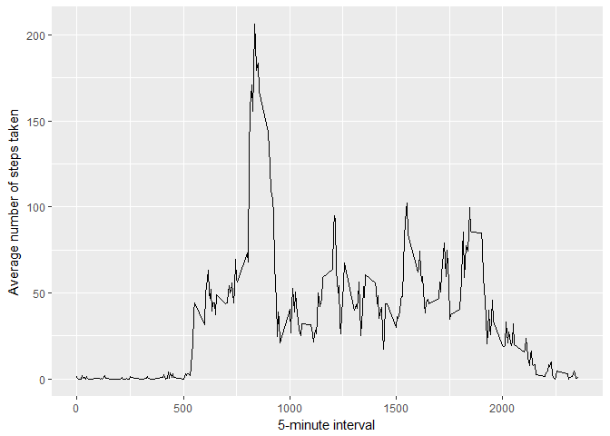

# Reproducible Research: Peer Assessment 1
Wing Chum  


## Loading and preprocessing the data

<!-- setwd("D:/My_Course_Work/Reproducible Research/Course_Project_1") -->

```r
act_data <- read.csv("activity.csv")
```

## What is mean total number of steps taken per day?


```r
total_by_date.steps <- tapply(act_data$steps, act_data$date, FUN=sum, na.rm=TRUE)
qplot(total_by_date.steps, binwidth=1000, xlab="Total number of steps taken each day")
```

<!-- -->

```r
## Quick summary showing the means and median
mean(total_by_date.steps, na.rm = TRUE)
```

```
## [1] 9354.23
```

```r
median(total_by_date.steps, na.rm = TRUE)
```

```
## [1] 10395
```


## What is the average daily activity pattern?


```r
avg_steps_by_interval <- aggregate(x=list(steps=act_data$steps), by=list(interval=act_data$interval),
                      FUN=mean, na.rm=TRUE)
ggplot(data=avg_steps_by_interval, aes(x=interval, y=steps)) +
    geom_line() +
    xlab("5-minute interval") +
    ylab("Average number of steps taken")
```

<!-- -->


On average, the interval 835 contains the maximum number of steps.

## What is the average daily activity pattern?

There are a number of days/intervals where there are missing values (coded as NA); the folowing code will show a quick summary of the number of NAs and replace those NA with the mean


```r
NAs <- is.na(act_data$steps)
# Show table of NAs
table(NAs)
```

```
## NAs
## FALSE  TRUE 
## 15264  2304
```

```r
# Replace each missing value with the mean value of its 5-minute interval
replaceNA.value <- function(steps, interval) {
    replaced <- NA
    if (!is.na(steps))
        replaced <- c(steps)
    else
        replaced <- (avg_steps_by_interval[avg_steps_by_interval$interval==interval, "steps"])
    return(replaced)
}
replaced.data <- act_data
replaced.data$steps <- mapply(replaceNA.value, replaced.data$steps, replaced.data$interval)
```

Below is the histogram for number of steps taken each day using the new data set with NA replaced with mean

```r
total_by_date.steps <- tapply(replaced.data$steps, replaced.data$date, FUN=sum, na.rm=TRUE)
qplot(total_by_date.steps, binwidth=1000, xlab="Total number of steps taken each day")
```

<!-- -->

```r
## show the summary again to make sure the means, medians arent affected by the above codes
mean(total_by_date.steps, na.rm = TRUE)
```

```
## [1] 10766.19
```

```r
median(total_by_date.steps, na.rm = TRUE)
```

```
## [1] 10766.19
```

## Are there differences in activity patterns between weekdays and weekends?

```r
## determine whether its weekday of weekend
weekday.or.weekend <- function(date) {
    day <- weekdays(date)
    if (day %in% c("Monday", "Tuesday", "Wednesday", "Thursday", "Friday"))
        return("weekday")
    else if (day %in% c("Saturday", "Sunday"))
        return("weekend")
    else
        stop("Invalid date")
}
replaced.data$date <- as.Date(replaced.data$date)
replaced.data$day <- sapply(replaced.data$date, FUN=weekday.or.weekend)
```

Below is a plot showing Weekdays Vs Weekend

```r
averages <- aggregate(steps ~ interval + day, data=replaced.data, mean)
ggplot(averages, aes(interval, steps)) + geom_line() + facet_grid(day ~ .) +
    xlab("5-minute interval") + ylab("Number of steps")
```

<!-- -->
